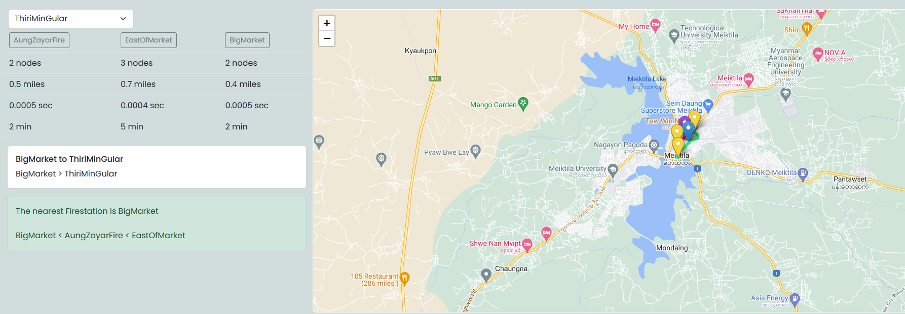

# Project: A* algorithm on google maps to find shortest path (googlemapsastar)
__Data:__
* Data has been extracted from [Meiktila](https://leafletjs.com/).  
* It contains ~3 Quarters and 5 Firestations  

__Algorithm: A*__

__UI:__

* You can select quarters on the map. That quarters will be treated as fire disaster place.Three firestations that can reach to that selected Quarters will be shown on the map and calcualte shortest route to reach there.
* In order to generate nearest firestation,bubble sort algorithm is used and it will sort based on distance.
* Path will be displayed by marker with "color" animation.

__Output:__

* Due to larger number of nodes present in a map. A* becomes really slow. As it highly depends on branching factor : __O(b^d)__ 
* Hence, it works really well when source and destination are placed nearby.
* Consider below example:
  * Source: (40.49840455168209, -74.44476100847496)
  * Destination: (40.49923169717668,-74.4478649066509)
    * Output generated by Google Maps: Cost:- 0.4828 km (0.3 mi)
    * Output generated by A*: Cost:-  0.337249 km

  
  

P.S. : Hit me up if you have any doubt.

installation
-----------------------
pip install flask

run ရမည့် file ---> flaskAPI.py
run ချိန်တွင် terminal ကိုဖွင့်၍ အောက်ပါ command ကို ရိုက်ပေး၍ run ရမည်ဖြစ်သည်။
-python flaskAPI.py

nodes folder and nodes png folder
-----------------------------------------
-nodes folder ထဲတွင်ရှိသော "QuarterName".py file 3 ခု သည် A * algorithm အတွက် တစ် node မှ တစ်node ဆွဲထားသော route များကို ထည့်ထားပေးခြင်းဖြစ်သည်။ 
- {
    'fromNode' : [('toNode',distance,time),('toNode',distance,time),......],
      or
    'fromNode' : [('toNode',distance,time)]
}
***node အပိတ်များဖြစ်သွားပါက [] list အလွတ်တစ်ခုထည့်ပေးရမည်။ 
* distance and time ကို real google map ထဲသို့ lat lon များထည့်၍ ရသော data များမှယူရမည်ဖြစ်သည်။ 
-distance သည် miles ဖြင့်ယူထား၍ time ကို second ဖြင့်ယူထည့်ထားသည်။ 
-nodes ဆွဲသည့်နည်းမှာ nodes png folder ထဲတွင်ပြထားသည့်အတိုင်းဖြစ်သည်။ starting node သည် ထို Quarter သို့ရောက်နိုင်သည့် 
firestation ဖြစ်၍ end node သည် Quarterဖြစ်သည်။ အလယ်မှ Node များသည် ဖြတ်သွားမည့် street များဖြစ်သည်။ မည်သည့် street
များကို ဖြတ်နိုင်သည်ကို မူ map ပေါ်တွင် lat lon တန်ဖိုးချ၍ ကြည့်ကာ ထည့်ထားခြင်းဖြစ်သည်။ 
-အကယ်၍ ထပ်မံထည့်ချင်သော Quarter များရှိလာခဲ့ပါက ထိုကဲ့သို့ အလားတူ node များကို အထက်တွင်ဖော်ပြထားသည့် အတိုင်းပြုလုပ်၍ ထည့်နိုင်ပါသည်။ 

-Quarter များ node များ ထပ်ထည့်ပါက 
1.map.js
2.map.html 
3.flaskAPI.py
action.js ကိုပြင်ရန်မလိုအပ်ပါ။ 
